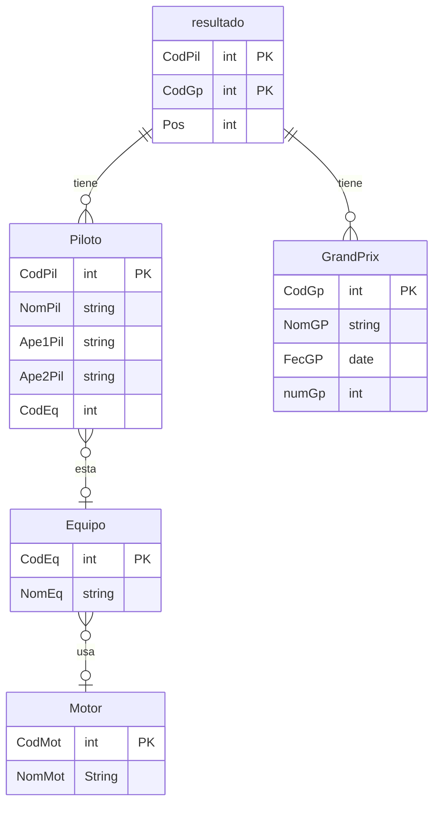

# Proyecto de Bases de datos
Este repositorio es sobre un proyecto con una bases de datos con java y mysql.
# Creación de la base de datos
Vamos a hacer una base de datos sobre F1
## Hacer diagrama de entidades
Este seria el diagrama de entidades hecho con mermaid

# programa
El programa sera de gestión de la temporada con calculado de ranking de equipos y de pilotos,también se calculara los puntos según el sistema actual,también se permitirá insertar datos en cada una de las tablas.
## Sistema de puntos
para el calculo de puntos se usara el siguiente sistema(el actual)
| posicion | puntos |
| -------- | ------ |
| 1        | 25     |
| 2        | 18     |
| 3        | 15     |
| 4        | 12     |
| 5        | 10     |
| 6        | 8      |
| 7        | 6      |
| 8        | 4      |
| 9        | 2      |
| 10       | 1      |

