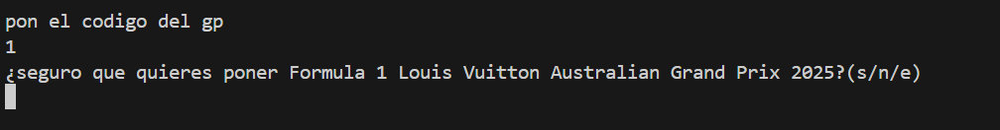

# Proyecto de Bases de datos
Este repositorio es sobre un proyecto con una bases de datos con java y mysql.
# Creación de la base de datos
Vamos a hacer una base de datos sobre F1
## Hacer diagrama de entidades
Este seria el diagrama de entidades hecho con mermaid

# programa
El programa sera de gestión de la temporada con calculado de ranking de equipos y de pilotos,también se calculara los puntos según el sistema actual,también se permitirá insertar datos en cada una de las tablas.
## Menu
El programa nada mas iniciar el programa mostrara el siguiente menu:
```
1.Listar datos
2.Ver ranking
3.insertar en una tabla 
4.eliminar un campo
5.actualizar un campo
6.salir
```
<details>
  <summary><h1>Listar datos<h1></summary>
  La función de listar datos abrirá el siguiente submenu preguntando que datos quieres mostrar:

  ```
  1.pilotos
  2.Equipos
  3.Motor
  4.Resultados
  5.GPs
  ```
  a continuación enseñare que hace cada uno de los apartados
  <details>
  <summary><h2>Pilotos<h2></summary>
  en este menu se mostrara otro submenu preguntando como lo quieres listar 

  ```
  1.Listar todos los pilotos
  2.Listar los pilotos de un equipo
  ```
  a continuación enseñare que hace cada uno de los apartados
  <details>
  <summary><h3>Listar todos los pilotos</h3></summary>
  este mostrara todos los pilotos de la tabla pilotos de la siguiente manera

  <br>
  (no se ven todos los pilotos porque hay deslizar para verlos todos)
  </details>
  <details>
  <summary><h3>Listar los pilotos de un equipo</h3></summary>
  Esta opción mostraras los pilotos agrupados por equipo de la siguiente manera:

  
  </details>
  
  </details>
  <details>
  <summary><h2>Equipos</h2></summary>
  Esta opción muestra todos los equipos de la siguiente manera:

  

  </details>
  <details>
  <summary><h2>Motores</h2></summary>
  Esta opción devuelve todos los motores de la siguiente manera:

  
  </details>
  <details>
  <summary><h2>Resultados</h2></summary>
  Al darle te sale el siguiente menu:

  ```
  1.Listar resultados de un gp
  2.Listar resultados de un piloto
  ```
  a continuación enseñare que hace cada uno de los apartados
  <details>
  <summary><h3>Listar resultados de un gp</h3></summary>
  Te pide el código del GP y te pone una confirmación:
  

  <br>
  tras lo cual te pone los resultados del gp
  
  </details>
  <details>
  <summary><h3>Listar resultados de un piloto</h3></summary>
  
  </details>
  </details>
  </details>
</details>

## Sistema de puntos
para el calculo de puntos se usara el siguiente sistema(el actual)
| posicion | puntos |
| -------- | ------ |
| 1        | 25     |
| 2        | 18     |
| 3        | 15     |
| 4        | 12     |
| 5        | 10     |
| 6        | 8      |
| 7        | 6      |
| 8        | 4      |
| 9        | 2      |
| 10       | 1      |
